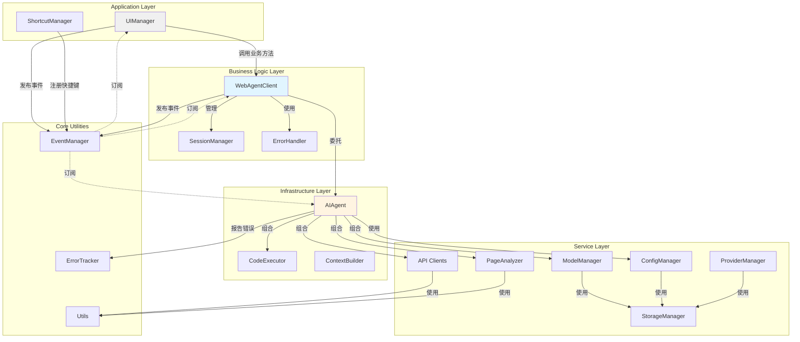

# AI Browser Agent v5.0 架构设计文档

**版本**: v5.0.0  
**设计日期**: 2026-04-18  
**核心理念**: 超级解耦，Main 负责启动，WebAgentClient 负责业务，React 负责 UI  
**状态**: 📐 设计中（待实施）

---

## 📋 目录

1. [设计愿景](#设计愿景)
2. [分层架构](#分层架构)
3. [新目录结构](#新目录结构)
4. [模块职责定义](#模块职责定义)
5. [数据流设计](#数据流设计)
6. [依赖关系图](#依赖关系图)
7. [分步重构计划](#分步重构计划)
8. [向后兼容性策略](#向后兼容性策略)
9. [风险评估与应对](#风险评估与应对)

---

## 设计愿景

### 核心目标

1. **职责清晰分离**：
   - **Main (园区建设)**: 程序启动、环境准备、模块初始化、事件接线
   - **WebAgentClient (园区工厂)**: 业务逻辑核心、流程编排、质量控制
   - **AIAgent (生产设备)**: 底层 AI 能力组合、技术实现
   - **UI (园区外观)**: React 组件化界面，纯视图层

2. **超级解耦**：各层之间通过明确接口通信，无隐式依赖

3. **易于扩展**：新功能只需在对应层添加，不影响其他层

4. **现代化 UI**：使用 React 重构界面，提升开发体验和可维护性

### 架构原则

```
┌─────────────────────────────────────────┐
│  Main Layer (程序启动层)                 │
│  - main.js                              │
│  - 职责：初始化模块、设置监听、暴露接口    │
└──────────────┬──────────────────────────┘
               │ 启动 WebAgentClient
┌──────────────▼──────────────────────────┐
│  Business Logic Layer (业务逻辑层)       │
│  - WebAgentClient (业务编排器)           │
│  - 会话管理、错误处理、流程控制           │
└──────────────┬──────────────────────────┘
               │ 委托给 AIAgent
┌──────────────▼──────────────────────────┐
│  Infrastructure Layer (基础设施层)       │
│  - AIAgent (组合器模式)                  │
│  - 整合 ModelManager, APIRouter,         │
│    PageAnalyzer, CodeExecutor            │
└──────────────┬──────────────────────────┘
               │ 使用服务
┌──────────────▼──────────────────────────┐
│  Service Layer (服务层)                  │
│  - api/ (API 客户端)                     │
│  - core/ (核心工具)                      │
│  - page-analyzer/ (页面分析)             │
│  - model-manager/ (模型管理)             │
└─────────────────────────────────────────┘

┌─────────────────────────────────────────┐
│  UI Layer (表现层) - React              │
│  - ChatWindow.jsx                       │
│  - MessageList.jsx                      │
│  - SettingsDialog.jsx                   │
│  - 通过事件与 WebAgentClient 通信        │
└─────────────────────────────────────────┘
```

### 关键改进点

| 维度 | v3.9.8 (现状) | v5.0 (目标) |
|------|---------------|-------------|
| 耦合度 | 高（ui.js 直接调用多个模块） | 低（分层清晰） |
| 可测试性 | 困难（全局依赖） | 容易（依赖注入） |
| 可扩展性 | 中等（需修改多处） | 高（插件化） |
| 代码复用 | 低（逻辑分散） | 高（集中在 Client） |
| 维护成本 | 高（牵一发动全身） | 低（边界清晰） |

---

## 📦 React 集成方案

### 技术选型理由

1. **组件化**：将 UI 拆分为独立可复用的组件
2. **声明式**：JSX 比字符串拼接 HTML 更直观
3. **响应式**：自动同步状态和 UI，无需手动操作 DOM
4. **生态丰富**：大量现成组件和工具
5. **开发体验**：热重载、类型检查、调试工具

---

### 在 Tampermonkey 中使用 React

#### 方案选择：预编译 + CDN 加载（推荐）

**原因**：
- ✅ 性能好（预编译 JSX）
- ✅ 不依赖外部 CDN（React 库打包进脚本）
- ✅ 完整的 React 生态
- ✅ 支持 TypeScript（可选）

**实现方式**：
```bash
# 1. 使用 Vite 创建 React 项目
npm create vite@latest ui -- --template react

# 2. 安装依赖
cd ui
npm install

# 3. 编写 React 组件
# src/app/ui/components/*.jsx

# 4. 构建为单个 JS 文件
npm run build

# 5. 将构建结果合并到 agent.user.js
node build.js  # 自动包含 React 运行时
```

---

### 构建流程整合

**build.js 修改**：
```javascript
const modules = [
    // ... 其他模块
    
    // React 运行时（生产环境）
    IS_RELEASE ? 'vendor/react.production.min.js' : 'vendor/react.development.js',
    IS_RELEASE ? 'vendor/react-dom.production.min.js' : 'vendor/react-dom.development.js',
    
    // React UI 组件
    'app/ui/index.jsx',           // 根组件
    'app/ui/components/*.jsx',    // UI 组件
    'app/ui/hooks/*.js',          // Hooks
    
    'main.js'
];
```

**注意**：
- React 库文件需要预先下载到 `src/vendor/` 目录
- JSX 文件需要通过 Babel 转译（可在构建时处理）

---

### 渐进式迁移策略

**Phase 1**: 先用 React 重写设置对话框
- 小范围试验，风险低
- 验证 React 集成方案
- 熟悉 React 开发模式

**Phase 2**: 重写聊天窗口核心组件
- MessageList
- MessageItem
- CodeBlock

**Phase 3**: 完全替换旧 UI
- 移除 ui.js, ui-styles.js, ui-templates.js
- 全面使用 React 组件

---

## 分层架构

### Layer 1: Main Layer (程序启动层) - "园区建设"

**职责**：程序启动、环境准备、模块初始化、事件接线

**包含模块**：
- `main.js` - 应用入口

**允许的操作**：
- ✅ 初始化所有核心模块（ConfigManager, EventManager, ErrorTracker...）
- ✅ 初始化业务层（WebAgentClient）
- ✅ 设置全局事件监听器（连接 UI 事件到 Client）
- ✅ 创建启动按钮
- ✅ 暴露全局调试接口（unsafeWindow.WebAgentClient）

**禁止的操作**：
- ❌ 包含业务逻辑（消息验证、错误处理策略）
- ❌ 直接操作 DOM（除了启动按钮）
- ❌ 直接调用 AIAgent 或 API 客户端
- ❌ 处理用户交互细节

**示例**：
```javascript
// main.js - 只做"启动"和"接线"
async function init() {
    // 1. 初始化基础设施
    await initCoreModules();  // ConfigManager, EventManager...
    
    // 2. 启动"工厂"
    await WebAgentClient.init();  // 业务逻辑层
    
    // 3. 连接 UI 事件到 Client
    setupEventListeners();
    
    // 4. 暴露调试接口
    unsafeWindow.WebAgentClient = WebAgentClient;
}
```

---

### Layer 2: Business Logic Layer (业务逻辑层) - "园区工厂"

**职责**：业务流程编排、状态管理、错误处理、生命周期管理

**包含模块**：
- `business/WebAgentClient.js` - 核心业务编排器（已创建）
- `business/SessionManager.js` - 会话管理（新增）
- `business/ErrorHandler.js` - 错误处理策略（新增）

**允许的操作**：
- ✅ 调用 AIAgent 的基础设施方法
- ✅ 管理会话状态
- ✅ 实现错误处理策略
- ✅ 触发业务事件
- ✅ 持久化设置

**禁止的操作**：
- ❌ 直接操作 DOM
- ❌ 直接调用 API 客户端
- ❌ 包含 UI 渲染逻辑

**示例**：
```javascript
// WebAgentClient.js - 工厂的生产线
async function handleUserMessage(message) {
    // 1. 质检（验证输入）
    this.validateMessage(message);
    
    // 2. 调用生产线（AIAgent）
    const result = await AIAgent.sendMessage(message);
    
    // 3. 包装产品（格式化结果）
    const packaged = this.packageResult(result);
    
    // 4. 发货通知（触发事件）
    EventManager.emit('MESSAGE_COMPLETE', packaged);
}
```

---

### Layer 3: Infrastructure Layer (基础设施层)

**职责**：提供底层 AI 能力，组合各种服务

**包含模块**：
- `infrastructure/AIAgent/index.js` - Agent 核心（已创建）
- `infrastructure/AIAgent/CodeExecutor.js` - 代码执行器（已创建）

**允许的操作**：
- ✅ 组合底层服务（ModelManager, APIRouter, PageAnalyzer）
- ✅ 构建消息上下文
- ✅ 管理对话历史
- ✅ 提供统一的 Agent 接口

**禁止的操作**：
- ❌ 直接操作 DOM
- ❌ 包含业务流程逻辑
- ❌ 处理用户交互细节

---

### Layer 4: Service Layer (服务层)

**职责**：提供具体的功能服务

**包含模块**：
- `services/api/` - API 客户端系列
  - `BaseAPIClient.js` - 基础类
  - `OpenRouterClient.js` - OpenRouter 实现
  - `LMStudioClient.js` - LM Studio 实现
  - `index.js` - 工厂函数
- `services/page-analyzer/PageAnalyzer.js` - 页面分析器
- `services/model-manager/ModelManager.js` - 模型管理器（从 models.js 提取）
- `services/config/ConfigManager.js` - 配置管理（从 core/ 迁移）
- `services/storage/StorageManager.js` - 存储管理（新增）

**允许的操作**：
- ✅ 实现具体功能
- ✅ 访问 Tampermonkey API
- ✅ 网络请求
- ✅ 数据存储

**禁止的操作**：
- ❌ 包含业务逻辑
- ❌ 直接操作 DOM
- ❌ 知道上层模块的存在

---

### Layer 6: Core Utilities (核心工具层)

**职责**：通用工具函数，无业务含义

**包含模块**：
- `core/utils.js` - 工具函数
- `core/EventManager.js` - 事件总线
- `core/ErrorTracker.js` - 错误追踪

**特点**：
- 无状态或轻量状态
- 被所有层使用
- 不依赖其他模块

---

### Layer 5: UI Layer (表现层) - React 组件化

**职责**：用户界面展示、用户输入捕获、状态可视化

**技术栈**：
- React 18
- JSX
- React Hooks

**包含模块**：
```
src/app/ui/
├── index.jsx              # React 根组件
├── components/
│   ├── ChatWindow.jsx     # 聊天窗口
│   ├── MessageList.jsx    # 消息列表
│   ├── MessageItem.jsx    # 单条消息
│   ├── CodeBlock.jsx      # 代码块
│   ├── SettingsDialog.jsx # 设置对话框
│   ├── ModelSelector.jsx  # 模型选择器
│   └── Toolbar.jsx        # 工具栏
├── hooks/
│   ├── useAgent.js        # 连接 WebAgentClient
│   ├── useMessages.js     # 消息状态管理
│   └── useSettings.js     # 设置状态管理
└── styles/
    ├── global.css         # 全局样式
    └── components.css     # 组件样式
```

**允许的操作**：
- ✅ 渲染 React 组件
- ✅ 捕获用户输入
- ✅ 通过事件与 WebAgentClient 通信
- ✅ 显示状态变化

**禁止的操作**：
- ❌ 直接调用 AIAgent
- ❌ 直接调用 API 客户端
- ❌ 包含业务逻辑（消息验证、错误处理）
- ❌ 直接操作配置存储

**示例**：
```jsx
// ChatWindow.jsx
function ChatWindow() {
    const { messages, isProcessing, sendMessage } = useAgent();
    const [inputValue, setInputValue] = useState('');
    
    const handleSubmit = (e) => {
        e.preventDefault();
        if (inputValue.trim()) {
            sendMessage(inputValue);  // 调用 WebAgentClient
            setInputValue('');
        }
    };
    
    return (
        <div className="chat-window">
            <MessageList messages={messages} />
            <form onSubmit={handleSubmit}>
                <input value={inputValue} onChange={...} />
                <button type="submit">发送</button>
            </form>
        </div>
    );
}
```

---

## 新目录结构

```
src/
├── main.js                       # 程序启动层（园区建设）
│
├── business/                     # 业务逻辑层（园区工厂）
│   ├── WebAgentClient.js         # 业务编排器（已创建）
│   ├── SessionManager.js         # 会话管理（新增）
│   └── ErrorHandler.js           # 错误处理策略（新增）
│
├── infrastructure/               # 基础设施层（生产设备）
│   └── AIAgent/                  # AI Agent
│       ├── index.js              # Agent 核心（已创建）
│       ├── CodeExecutor.js       # 代码执行器（已创建）
│       └── ContextBuilder.js     # 上下文构建器（新增）
│
├── services/                     # 服务层
│   ├── api/                      # API 客户端
│   │   ├── BaseAPIClient.js      # 基础类（已创建）
│   │   ├── OpenRouterClient.js   # OpenRouter（已创建）
│   │   ├── LMStudioClient.js     # LM Studio（已创建）
│   │   └── index.js              # 工厂（已创建）
│   ├── page-analyzer/            # 页面分析
│   │   └── PageAnalyzer.js       # 页面分析器（从 core/ 迁移）
│   ├── model-manager/            # 模型管理
│   │   └── ModelManager.js       # 模型管理器（从 models.js 提取）
│   ├── config/                   # 配置管理
│   │   └── ConfigManager.js      # 配置管理器（从 core/ 迁移）
│   ├── storage/                  # 存储管理（新增）
│   │   └── StorageManager.js     # 统一存储接口
│   └── provider/                 # 供应商管理
│       └── ProviderManager.js    # 供应商管理器（从 core/ 迁移）
│
├── app/                          # 应用层
│   ├── ui/                       # UI 模块 - React
│   │   ├── index.jsx             # React 根组件
│   │   ├── components/           # UI 组件
│   │   │   ├── ChatWindow.jsx    # 聊天窗口
│   │   │   ├── MessageList.jsx   # 消息列表
│   │   │   ├── MessageItem.jsx   # 单条消息
│   │   │   ├── CodeBlock.jsx     # 代码块
│   │   │   ├── SettingsDialog.jsx# 设置对话框
│   │   │   ├── ModelSelector.jsx # 模型选择器
│   │   │   └── Toolbar.jsx       # 工具栏
│   │   ├── hooks/                # React Hooks
│   │   │   ├── useAgent.js       # 连接 WebAgentClient
│   │   │   ├── useMessages.js    # 消息状态管理
│   │   │   └── useSettings.js    # 设置状态管理
│   │   └── styles/               # 样式
│   │       ├── global.css        # 全局样式
│   │       └── components.css    # 组件样式
│   └── shortcuts/                # 快捷键
│       └── ShortcutManager.js    # 快捷键管理（从 core/ 迁移）
│
└── core/                         # 核心工具层
    ├── utils.js                  # 工具函数
    ├── EventManager.js           # 事件总线
    └── ErrorTracker.js           # 错误追踪
```

### 文件迁移映射表

| 原路径 | 新路径 | 操作 |
|--------|--------|------|
| `src/main.js` | `src/main.js` | 重构（明确职责） |
| `src/ui.js` | **废弃** | 功能迁移到 React 组件 |
| `src/ui-styles.js` | `src/app/ui/styles/global.css` | 转换为 CSS |
| `src/ui-templates.js` | **废弃** | 功能迁移到 JSX 组件 |
| `src/models.js` | `src/services/model-manager/ModelManager.js` | 提取 + 移动 |
| `src/chat.js` | **废弃** | 功能迁移到 WebAgentClient |
| `src/core/ConfigManager.js` | `src/services/config/ConfigManager.js` | 移动 |
| `src/core/HistoryManager.js` | **合并到 AIAgent** | 功能整合 |
| `src/core/StateManager.js` | **合并到 UnifiedStateManager** | 功能整合 |
| `src/core/UnifiedStateManager.js` | `src/services/storage/StorageManager.js` | 重命名 |
| `src/core/ProviderManager.js` | `src/services/provider/ProviderManager.js` | 移动 |
| `src/core/PageAnalyzer.js` | `src/services/page-analyzer/PageAnalyzer.js` | 移动 |
| `src/core/ShortcutManager.js` | `src/app/shortcuts/ShortcutManager.js` | 移动 |
| `src/api-router.js` | **合并到 AIAgent** | 功能整合 |
| `src/api/*.js` | `src/services/api/*.js` | 移动 |
| `src/agent/index.js` | `src/infrastructure/AIAgent/index.js` | 移动 |
| `src/agent/WebAgentClient.js` | `src/business/WebAgentClient.js` | 移动 |
| `src/agent/CodeExecutor.js` | `src/infrastructure/AIAgent/CodeExecutor.js` | 移动 |
| **新增** | `src/app/ui/index.jsx` | React 根组件 |
| **新增** | `src/app/ui/components/*.jsx` | React UI 组件 |
| **新增** | `src/app/ui/hooks/*.js` | React Hooks |

---

## 模块职责定义

### WebAgentClient (业务编排层)

**输入**：
- 用户消息字符串
- 配置选项对象
- UI 状态变更通知

**输出**：
- AI 响应结果对象
- 业务事件（MESSAGE_COMPLETE, CODE_EXECUTED 等）
- 状态更新

**核心方法**：
```javascript
{
  init(options),                    // 初始化
  handleUserMessage(message, opts), // 处理用户消息
  handleCodeExecution(code, opts),  // 执行代码
  handleClearChat(),                // 清空对话
  handleCancelRequest(),            // 取消请求
  updateSettings(newSettings),      // 更新设置
  getState()                        // 获取状态
}
```

**不允许**：
- 直接操作 DOM
- 直接调用 API 客户端
- 包含 UI 渲染逻辑

---

### AIAgent (基础设施层)

**输入**：
- 消息数组
- 配置参数
- 回调函数（流式输出）

**输出**：
- AI 响应对象
- 代码执行结果

**核心方法**：
```javascript
{
  init(config),                     // 初始化
  sendMessage(message, opts),       // 发送消息
  executeCode(code, opts),          // 执行代码
  buildMessageContext(msg, opts),   // 构建上下文
  getPageContext(opts),             // 获取页面上下文
  clearHistory(),                   // 清空历史
  getState()                        // 获取状态
}
```

**不允许**：
- 直接操作 DOM
- 包含业务流程逻辑
- 处理用户交互细节

---

### UIManager (应用层)

**输入**：
- HTML 模板
- CSS 样式
- 用户交互事件

**输出**：
- DOM 元素
- UI 事件（USER_MESSAGE_SENT, SETTINGS_OPEN 等）

**核心方法**：
```javascript
{
  createAssistant(config),          // 创建主界面
  show(),                           // 显示窗口
  hide(),                           // 隐藏窗口
  appendMessage(html),              // 追加消息
  showTypingIndicator(),            // 显示打字指示器
  updateSendButtonState(bool),      // 更新按钮状态
  on(event, callback)               // 注册 UI 事件监听
}
```

**不允许**：
- 直接调用 AIAgent
- 直接调用 API 客户端
- 包含业务逻辑（消息验证、错误处理）

---

### ModelManager (服务层)

**输入**：
- API 密钥
- 供应商配置

**输出**：
- 模型列表
- 模型测试结果

**核心方法**：
```javascript
{
  fetchModels(provider),            // 获取模型列表
  cacheModels(models),              // 缓存模型
  loadCachedModels(),               // 加载缓存
  testModel(modelId),               // 测试模型
  refreshModels(provider)           // 刷新模型
}
```

**不允许**：
- 直接操作 DOM
- 包含业务逻辑

---

## 数据流设计

### 场景 1: 用户发送消息

```
用户输入 "你好"
  ↓
[App Layer] UIManager 捕获 Enter 键
  ↓
[App Layer] UIManager.emit('USER_MESSAGE_SENT', '你好')
  ↓
[Business Layer] WebAgentClient 监听到事件
  ↓
[Business Layer] WebAgentClient.handleUserMessage('你好')
  ├─ 验证消息（非空、长度限制）
  ├─ 检查是否正在处理
  └─ 调用 AIAgent.sendMessage()
  ↓
[Infrastructure Layer] AIAgent.sendMessage('你好')
  ├─ 构建消息上下文
  │   ├─ 系统提示词
  │   ├─ 页面上下文（可选）
  │   └─ 对话历史
  ├─ 调用 APIRouter.sendRequest()
  │   ├─ 选择模型
  │   ├─ 发起 HTTP 请求
  │   └─ 流式返回响应
  └─ 更新对话历史
  ↓
[Business Layer] WebAgentClient 接收响应
  ├─ 触发 MESSAGE_STREAMING 事件（流式更新）
  ├─ 检测代码块
  └─ 触发 MESSAGE_COMPLETE 事件
  ↓
[App Layer] UIManager 监听到事件
  ├─ 显示 AI 消息
  ├─ 显示代码块（如果有）
  └─ 更新按钮状态
```

### 场景 2: 执行代码

```
AI 回复包含 ```javascript 代码块
  ↓
[App Layer] UIManager 检测到代码块
  ↓
[App Layer] UIManager.emit('CODE_BLOCK_DETECTED', code)
  ↓
[Business Layer] WebAgentClient 监听到事件
  ↓
[Business Layer] WebAgentClient.handleCodeExecution(code)
  ├─ 安全检查（高危代码检测）
  ├─ 用户确认（如果需要）
  └─ 调用 AIAgent.executeCode()
  ↓
[Infrastructure Layer] AIAgent.executeCode(code)
  ├─ 委托给 CodeExecutor
  ├─ 执行代码（unsafeWindow.eval）
  └─ 返回执行结果
  ↓
[Business Layer] WebAgentClient 接收结果
  ├─ 格式化结果
  └─ 触发 CODE_EXECUTED 事件
  ↓
[App Layer] UIManager 监听到事件
  └─ 显示执行结果
```

### 场景 3: 更新设置

```
用户打开设置对话框并修改配置
  ↓
[App Layer] UIManager 捕获保存按钮点击
  ↓
[App Layer] UIManager.emit('SETTINGS_SAVED', newSettings)
  ↓
[Business Layer] WebAgentClient 监听到事件
  ↓
[Business Layer] WebAgentClient.updateSettings(newSettings)
  ├─ 验证设置
  ├─ 持久化到 ConfigManager
  ├─ 更新 AIAgent 配置
  └─ 触发 SETTINGS_UPDATED 事件
  ↓
[Infrastructure Layer] AIAgent.updateConfig(newSettings)
  └─ 更新内部配置缓存
  ↓
[App Layer] UIManager 监听到事件
  └─ 关闭设置对话框
```

---

## 依赖关系图



---

## 分步重构计划

### Phase 0: 准备阶段（已完成）

- ✅ 创建 `src/agent/` 目录
- ✅ 创建 `AIAgent` 基础设施层
- ✅ 创建 `WebAgentClient` 业务逻辑层
- ✅ 创建 `CodeExecutor` 代码执行器
- ✅ 创建 API 客户端抽象层
- ✅ 创建 `PageAnalyzer` 页面分析器
- ✅ 创建 `UnifiedStateManager` 统一状态管理

**状态**：✅ 完成

---

### Phase 1: 明确 Main 和 WebAgentClient 职责（预计 2 小时）

**目标**：让 main.js 只做启动和接线，WebAgentClient 接管所有业务逻辑

**步骤**：
1. 重构 main.js，移除业务逻辑
2. 确保所有用户交互通过 WebAgentClient
3. 从 ui.js 和 chat.js 迁移核心逻辑到 WebAgentClient
4. 测试事件流是否正常

**main.js 重构后**：
```javascript
async function init() {
    // 1. 初始化基础设施
    await initCoreModules();
    
    // 2. 启动"工厂"
    await WebAgentClient.init();
    
    // 3. 连接 UI 事件到 Client
    setupEventListeners();
    
    // 4. 暴露调试接口
    unsafeWindow.WebAgentClient = WebAgentClient;
}
```

**风险**：
- ⚠️ 遗漏某些业务逻辑
- ⚠️ 事件监听器未正确连接

**回滚方案**：
- Git 提交前备份，失败则 `git reset --hard`

**验收标准**：
- ✅ main.js 不包含业务逻辑
- ✅ 所有消息发送经过 WebAgentClient
- ✅ 所有代码执行经过 WebAgentClient
- ✅ 功能完全正常

---

### Phase 2: 引入 React 基础环境（预计 3 小时）

**目标**：搭建 React 开发环境，验证集成方案

**步骤**：
1. 下载 React 库文件到 `src/vendor/`
2. 配置 build.js 支持 JSX 转译
3. 创建第一个 React 组件（HelloWorld）
4. 测试 React 组件渲染

**React 库文件准备**：
```bash
# 下载 React 生产版本
curl -o src/vendor/react.production.min.js https://unpkg.com/react@18/umd/react.production.min.js
curl -o src/vendor/react-dom.production.min.js https://unpkg.com/react-dom@18/umd/react-dom.production.min.js
```

**build.js 修改**：
```javascript
const modules = [
    // ... 其他模块
    
    // React 运行时
    'vendor/react.production.min.js',
    'vendor/react-dom.production.min.js',
    
    // React UI
    'app/ui/index.jsx',
    
    'main.js'
];
```

**第一个 React 组件**：
```jsx
// src/app/ui/index.jsx
function HelloWorld() {
    return React.createElement('div', null, 'Hello from React!');
}

// 挂载到 DOM
const root = ReactDOM.createRoot(document.getElementById('root'));
root.render(React.createElement(HelloWorld));
```

**风险**：
- ⚠️ JSX 转译失败
- ⚠️ React 库加载顺序错误

**回滚方案**：
- 保留旧的 ui.js 作为 fallback

**验收标准**：
- ✅ React 组件成功渲染
- ✅ 构建成功
- ✅ 脚本正常运行

---

### Phase 3: 用 React 重写设置对话框（预计 4 小时）

**目标**：小范围试验，验证 React 可行性

**步骤**：
1. 创建 SettingsDialog.jsx 组件
2. 实现设置表单逻辑
3. 通过 Hook 连接 WebAgentClient
4. 替换旧的设置对话框

**SettingsDialog.jsx**：
```jsx
function SettingsDialog({ isOpen, onClose }) {
    const [settings, setSettings] = useSettings();
    
    const handleSave = async () => {
        await WebAgentClient.updateSettings(settings);
        onClose();
    };
    
    if (!isOpen) return null;
    
    return (
        <div className="modal-overlay">
            <div className="modal-content">
                <h2>设置</h2>
                <form onSubmit={handleSave}>
                    {/* 表单项 */}
                </form>
            </div>
        </div>
    );
}
```

**useSettings Hook**：
```javascript
// src/app/ui/hooks/useSettings.js
function useSettings() {
    const [settings, setSettings] = useState({});
    
    useEffect(() => {
        // 从 ConfigManager 加载
        setSettings({
            model: ConfigManager.getConfig('model'),
            temperature: ConfigManager.getConfig('temperature')
        });
    }, []);
    
    return [settings, setSettings];
}
```

**风险**：
- ⚠️ 样式不兼容
- ⚠️ 事件处理不一致

**回滚方案**：
- 保留旧的设置对话框代码

**验收标准**：
- ✅ 设置对话框正常打开/关闭
- ✅ 设置保存正常
- ✅ 外观与旧版一致

---

### Phase 4: 目录结构调整（预计 2 小时）

**目标**：建立新的目录结构，移动文件但不修改内容

**步骤**：
1. 创建新目录结构
2. 移动文件到新位置
3. 更新 `build.js` 中的模块路径
4. 运行构建测试

**文件移动清单**：
```bash
# 创建目录
mkdir -p src/app/ui/components
mkdir -p src/app/shortcuts
mkdir -p src/business
mkdir -p src/infrastructure/AIAgent
mkdir -p src/services/api
mkdir -p src/services/page-analyzer
mkdir -p src/services/model-manager
mkdir -p src/services/config
mkdir -p src/services/storage
mkdir -p src/services/provider

# 移动文件
mv src/ui.js src/app/ui/index.js
mv src/ui-styles.js src/app/ui/styles.js
mv src/ui-templates.js src/app/ui/templates.js
mv src/core/ShortcutManager.js src/app/shortcuts/ShortcutManager.js
mv src/agent/WebAgentClient.js src/business/WebAgentClient.js
mv src/agent/index.js src/infrastructure/AIAgent/index.js
mv src/agent/CodeExecutor.js src/infrastructure/AIAgent/CodeExecutor.js
mv src/api/*.js src/services/api/
mv src/core/PageAnalyzer.js src/services/page-analyzer/PageAnalyzer.js
mv src/core/ConfigManager.js src/services/config/ConfigManager.js
mv src/core/ProviderManager.js src/services/provider/ProviderManager.js
mv src/core/UnifiedStateManager.js src/services/storage/StorageManager.js
```

**风险**：
- ⚠️ 文件路径引用错误
- ⚠️ 构建失败

**回滚方案**：
- Git 提交前备份，失败则 `git reset --hard`

**验收标准**：
- ✅ 构建成功
- ✅ 脚本正常运行
- ✅ 所有功能正常

---

### Phase 2: 创建 UIBridge（预计 3 小时）

**目标**：创建 UI 和业务逻辑之间的桥接层

**步骤**：
1. 创建 `src/app/ui/UIBridge.js`
2. 实现事件映射和转换
3. 更新 `main.js` 初始化 UIBridge
4. 测试事件流

**UIBridge 职责**：
```javascript
const UIBridge = (function() {
    'use strict';

    function init() {
        // 1. 监听 UI 事件 → 调用 WebAgentClient
        EventManager.on('USER_MESSAGE_SENT', (message) => {
            WebAgentClient.handleUserMessage(message);
        });

        // 2. 监听 WebAgentClient 事件 → 触发 UI 更新
        EventManager.on('MESSAGE_STREAMING', (data) => {
            UIManager.updateStreamingMessage(data.chunk);
        });

        EventManager.on('MESSAGE_COMPLETE', (data) => {
            UIManager.appendAssistantMessage(data.result.content);
        });

        EventManager.on('CODE_EXECUTED', (data) => {
            UIManager.appendExecutionResult(data.result);
        });
    }

    return { init };
})();
```

**风险**：
- ⚠️ 事件名称冲突
- ⚠️ 循环依赖

**回滚方案**：
- 保留旧的事件监听器作为 fallback

**验收标准**：
- ✅ 消息发送正常
- ✅ 流式输出正常
- ✅ 代码执行正常

---

### Phase 5: 重构 UIManager 为 React 组件（预计 6 小时）

**目标**：将 ui.js 完全替换为 React 组件

**步骤**：
1. 创建 ChatWindow.jsx 主组件
2. 创建 MessageList.jsx, MessageItem.jsx
3. 创建 CodeBlock.jsx
4. 实现 useAgent Hook 连接 WebAgentClient
5. 移除旧的 ui.js

**需要创建的组件**：
- ✅ ChatWindow.jsx - 聊天窗口主组件
- ✅ MessageList.jsx - 消息列表
- ✅ MessageItem.jsx - 单条消息
- ✅ CodeBlock.jsx - 代码块
- ✅ Toolbar.jsx - 工具栏

**需要创建的 Hooks**：
- ✅ useAgent.js - 连接 WebAgentClient
- ✅ useMessages.js - 消息状态管理
- ✅ useSettings.js - 设置状态管理

**重构后的架构**：
```jsx
// ChatWindow.jsx - React 主组件
function ChatWindow() {
    const { messages, isProcessing, sendMessage } = useAgent();
    const [inputValue, setInputValue] = useState('');
    
    return (
        <div className="chat-window">
            <MessageList messages={messages} />
            <InputArea 
                value={inputValue}
                onChange={setInputValue}
                onSend={sendMessage}
                disabled={isProcessing}
            />
        </div>
    );
}
```

**风险**：
- ⚠️ JSX 转译问题
- ⚠️ 样式不兼容
- ⚠️ 性能问题

**回滚方案**：
- 保留完整的 git diff，可快速回退
- 保留旧的 ui.js 作为 fallback

**验收标准**：
- ✅ UI 外观不变或更好
- ✅ 所有交互正常
- ✅ 性能无明显下降
- ✅ 代码量减少 50%+

---

### Phase 6: 废弃 chat.js（预计 3 小时）

**目标**：将 chat.js 的功能完全迁移到 WebAgentClient

**步骤**：
1. 分析 chat.js 的所有功能
2. 确认 WebAgentClient 已覆盖所有功能
3. 更新 main.js 移除 chat.js 引用
4. 删除 chat.js 文件

**chat.js 功能清单**：
- ✅ handleMessage → WebAgentClient.handleUserMessage()
- ✅ executeJavaScript → WebAgentClient.handleCodeExecution()
- ✅ clearChat → WebAgentClient.handleClearChat()
- ✅ stopCurrentRequest → WebAgentClient.handleCancelRequest()

**风险**：
- ⚠️ 遗漏边缘情况
- ⚠️ 历史记录丢失

**回滚方案**：
- 先注释掉 chat.js 引用，测试一周后再删除

**验收标准**：
- ✅ 所有聊天功能正常
- ✅ 代码执行正常
- ✅ 历史记录正常

---

### Phase 7: 重构 models.js（预计 3 小时）

**目标**：将 models.js 拆分为 ModelManager 服务和 ModelStateManager

**步骤**：
1. 提取 ModelManager 到 `src/services/model-manager/ModelManager.js`
2. 创建 ModelStateManager 管理模型选择状态
3. 移除 models.js 中的 UI 更新逻辑
4. 通过事件驱动更新 UI

**重构后的 ModelManager**：
```javascript
const ModelManager = (function() {
    'use strict';

    // 只包含：
    // 1. 模型获取
    // 2. 模型缓存
    // 3. 模型测试
    // 4. 模型列表管理

    async function fetchModels(provider) {
        // 调用 API 获取模型
    }

    function cacheModels(models) {
        // 缓存到 StorageManager
    }

    async function testModel(modelId) {
        // 测试模型可用性
    }

    return {
        fetchModels,
        cacheModels,
        loadCachedModels,
        testModel
    };
})();
```

**风险**：
- ⚠️ 模型选择状态不同步
- ⚠️ 缓存失效

**回滚方案**：
- 保留旧的 models.js 作为 backup

**验收标准**：
- ✅ 模型列表正常加载
- ✅ 模型切换正常
- ✅ 模型测试正常

---

### Phase 8: 清理和优化（预计 2 小时）

**目标**：删除废弃文件，优化代码结构

**步骤**：
1. 删除废弃文件（chat.js, api-router.js 等）
2. 更新所有 import/reference
3. 运行完整测试
4. 更新 ARCHITECTURE.md

**删除清单**：
- ❌ `src/chat.js` - 功能已迁移
- ❌ `src/api-router.js` - 功能已整合到 AIAgent
- ❌ `src/core/HistoryManager.js` - 功能已整合到 AIAgent
- ❌ `src/core/StateManager.js` - 功能已整合到 UnifiedStateManager

**风险**：
- ⚠️ 遗漏引用
- ⚠️ 构建失败

**回滚方案**：
- Git tag 标记，可随时回退

**验收标准**：
- ✅ 构建成功
- ✅ 文件大小减少 20%+
- ✅ 所有功能正常

---

### Phase 9: 文档和测试（预计 2 小时）

**目标**：更新文档，补充测试

**步骤**：
1. 更新 ARCHITECTURE.md
2. 更新 README.md
3. 编写集成测试用例
4. 性能基准测试

**文档更新清单**：
- 📝 新的目录结构说明
- 📝 分层架构详解
- 📝 模块职责定义
- 📝 数据流图
- 📝 开发指南

**风险**：
- ⚠️ 文档过时
- ⚠️ 测试覆盖不全

**验收标准**：
- ✅ 文档完整准确
- ✅ 测试覆盖率 > 80%
- ✅ 性能无明显下降

---

## 向后兼容性策略

### 短期兼容（v5.0-beta）

**策略**：保留旧接口，添加警告日志

```javascript
// 示例：保留旧的 ChatManager 接口
const ChatManager = (function() {
    'use strict';

    console.warn('[DEPRECATED] ChatManager 将在 v6.0 中移除，请使用 WebAgentClient');

    function handleMessage(message) {
        return WebAgentClient.handleUserMessage(message);
    }

    return { handleMessage };
})();
```

**时间线**：
- v5.0-beta：同时支持新旧接口
- v5.0-rc：旧接口标记为 deprecated
- v5.0-stable：移除旧接口

---

### 长期兼容（v5.x）

**策略**：通过适配器模式支持旧插件

```javascript
// 适配器示例
const LegacyAdapter = (function() {
    'use strict';

    function adaptOldEventToNew(oldEventType) {
        const mapping = {
            'CHAT_MESSAGE_SENT': 'USER_MESSAGE_SENT',
            'AGENT_OPEN': 'UI_SHOW',
            'AGENT_CLOSE': 'UI_HIDE'
        };
        return mapping[oldEventType] || oldEventType;
    }

    return { adaptOldEventToNew };
})();
```

---

## 风险评估与应对

### 高风险项

#### 1. 数据丢失风险

**风险描述**：重构过程中可能导致用户配置、历史记录丢失

**影响程度**：🔴 高

**应对措施**：
- ✅ 重构前完整备份用户数据
- ✅ 提供数据迁移脚本
- ✅ 保留旧数据结构读取能力
- ✅ 充分的回归测试

**应急预案**：
- 立即回滚到上一版本
- 提供数据恢复工具

---

#### 2. 功能回归风险

**风险描述**：重构后某些功能无法正常工作

**影响程度**：🔴 高

**应对措施**：
- ✅ 制定详细的测试清单
- ✅ 每个 Phase 完成后进行完整测试
- ✅ 保留完整的 git 历史，可快速回滚
- ✅ Beta 测试期至少 1 周

**测试清单**：
- [ ] 消息发送和接收
- [ ] 流式输出
- [ ] 代码执行
- [ ] 模型切换
- [ ] 设置保存和加载
- [ ] 历史记录
- [ ] 快捷键
- [ ] 窗口拖动
- [ ] 供应商管理

---

#### 3. 性能下降风险

**风险描述**：分层架构可能引入额外的性能开销

**影响程度**：🟡 中

**应对措施**：
- ✅ 性能基准测试（重构前后对比）
- ✅ 优化事件传递路径
- ✅ 避免不必要的对象拷贝
- ✅ 使用 requestAnimationFrame 优化 UI 更新

**性能指标**：
- 消息发送延迟：< 100ms
- UI 响应时间：< 50ms
- 内存占用：增加 < 10%

---

### 中风险项

#### 4. 学习曲线风险

**风险描述**：新架构对开发者不够友好

**影响程度**：🟡 中

**应对措施**：
- ✅ 详细的架构文档
- ✅ 代码注释和 JSDoc
- ✅ 示例代码和最佳实践
- ✅ 开发者指南

---

#### 5. 第三方集成风险

**风险描述**：外部插件或扩展可能依赖旧接口

**影响程度**：🟡 中

**应对措施**：
- ✅ 提供适配器层
- ✅ 保持事件名称兼容
- ✅ 提供迁移指南
- ✅ 延长 deprecation 周期

---

### 低风险项

#### 6. 构建系统风险

**风险描述**：build.js 需要大量修改

**影响程度**：🟢 低

**应对措施**：
- ✅ 逐步更新模块路径
- ✅ 每次修改后立即测试构建
- ✅ 保留构建脚本备份

---

## 成功指标

### 技术指标

| 指标 | 当前值 | 目标值 | 测量方法 |
|------|--------|--------|----------|
| 代码耦合度 | 高 | 低 | 模块间直接引用数 < 5 |
| 可测试性 | 困难 | 容易 | 单元测试覆盖率 > 80% |
| 构建时间 | ~2s | < 3s | `time node build.js` |
| 文件大小 | ~350 KB | < 400 KB | 构建后文件大小 |
| 启动时间 | ~500ms | < 600ms | Performance API |

### 质量指标

| 指标 | 目标值 |
|------|--------|
| Bug 数量（重构引入） | 0 |
| 功能回归率 | 0% |
| 用户投诉率 | < 1% |
| 文档完整性 | 100% |

### 开发体验指标

| 指标 | 目标值 |
|------|--------|
| 新功能开发时间 | 减少 30% |
| Bug 修复时间 | 减少 40% |
| 代码审查时间 | 减少 20% |

---

## 总结

### 核心价值

1. **清晰的职责划分**：
   - Main (园区建设) → 只负责启动和接线
   - WebAgentClient (园区工厂) → 业务逻辑核心
   - AIAgent (生产设备) → 底层 AI 能力
   - React UI (园区外观) → 现代化组件化界面

2. **易于测试**：依赖注入，可 mock

3. **易于扩展**：新功能只需在对应层添加

4. **现代化开发体验**：React 组件化、JSX、Hooks

### 关键决策

1. ✅ **Main 只做启动**：不包含业务逻辑，只负责初始化和接线
2. ✅ **WebAgentClient 作为业务核心**：所有用户请求经过 Client
3. ✅ **AIAgent 作为基础设施**：提供底层能力，组合各种服务
4. ✅ **React 重构 UI**：组件化、声明式、响应式
5. ✅ **事件驱动通信**：解耦层间依赖
6. ✅ **渐进式重构**：分 9 个 Phase，降低风险

### 下一步行动

1. 📋 评审本设计文档
2. 🔧 开始 Phase 1：明确 Main 和 WebAgentClient 职责
3. ⚛️ Phase 2：引入 React 基础环境
4. 🧪 每个 Phase 完成后进行测试
5. 📝 持续更新文档

---

**文档作者**: AI Assistant  
**审核状态**: ⏳ 待审核  
**预计开始时间**: 用户确认后  
**预计完成时间**: 3-4 天（分 9 个 Phase）
